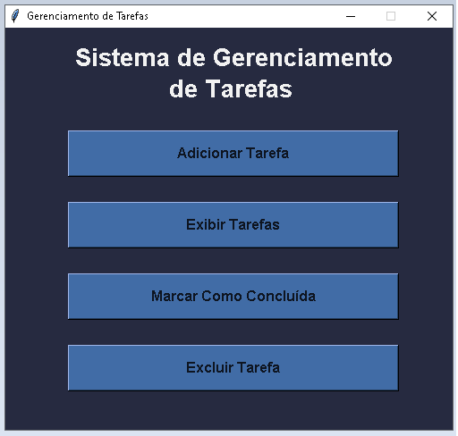

<h1 align='center'>Sistema de Gerenciamento de Tarefas</h1>

    
    
    

<h2>Sobre o Projeto</h2>

O Sistema de Gerenciamento de Tarefas é um projeto desenvolvido para aplicar os conhecimentos em <b>Python</b> e <b>Tkinter</b>. Ele oferece uma forma prática de organizar tarefas diárias, sejam pessoais, acadêmicas ou profissionais. Os usuários podem adicionar tarefas, fornecendo nome e descrição, também podendo marcá-las como concluídas, destacando-as na lista. A interface é simples, com botões intuitivos. O projeto oferece feedback visual para ações realizadas. É uma ferramenta útil para organizar atividades diárias de forma eficiente.

<h2>Layout do Projeto</h2>

<h2>Tecnologias Utilizadas</h2>
<ul type="disk">
    <li>Python</li>
    <li>TkInter</li>
    <li>PyInstaller</li>
</ul>

<h2>Autor</h2>

Linkedin: <a href="https://www.linkedin.com/in/henrique-azevedo-b2195b2b0/">https://www.linkedin.com/in/henrique-azevedo-b2195b2b0/</a>

Instagram: https://www.instagram.com/henriiqueaze/

Email: <a href="mailto:henriquee.aze.dev@gmail.com">henriique.aze.dev@gmail.com</a>
